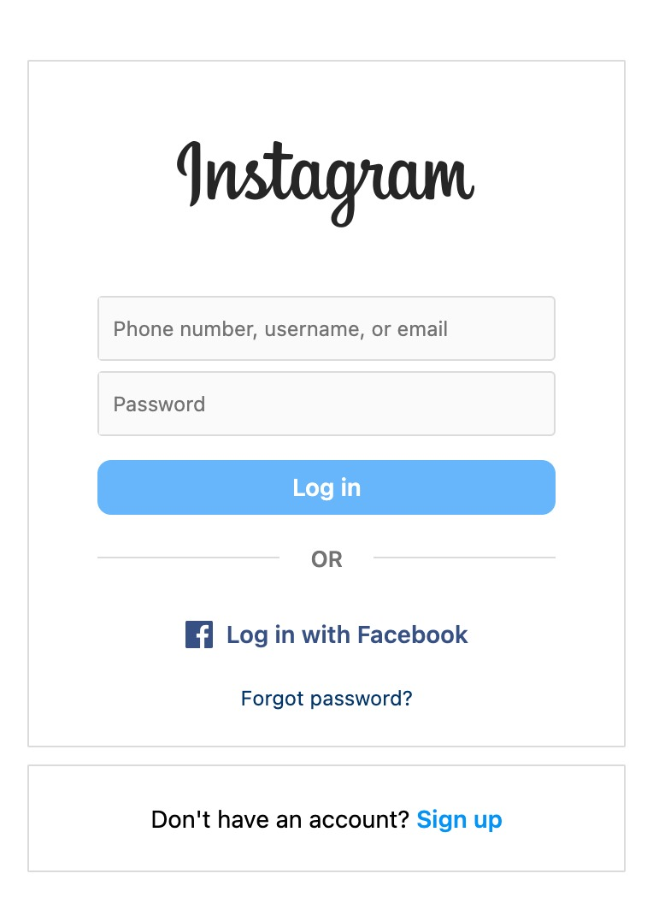

# Session 0

An Introduction to web development with the basics of HTML, CSS and Javascript

Slides: https://docs.google.com/presentation/d/1MZVe2qCIQ1-3POdqlFPJg9KySCoGWbe83sbk2bV5zpQ/edit?usp=sharing

Recording : https://drive.google.com/file/d/15gksP3D4L4XMgGl2GfQn0yP5-IBlcrcz/view?usp=drive_link

Learning Resources :

- https://www.w3schools.com/html/default.asp
- https://www.w3schools.com/css/default.asp
- https://www.w3schools.com/js/default.asp

## Task

Create a Login page as shown in the pic 

</img>

Deliverables : The created login page should have

1.  Pointer for login,login with Facebook, forgot password and sign up
2.  Make a hover effect to Log in block

Deadline: Sunday EOD
